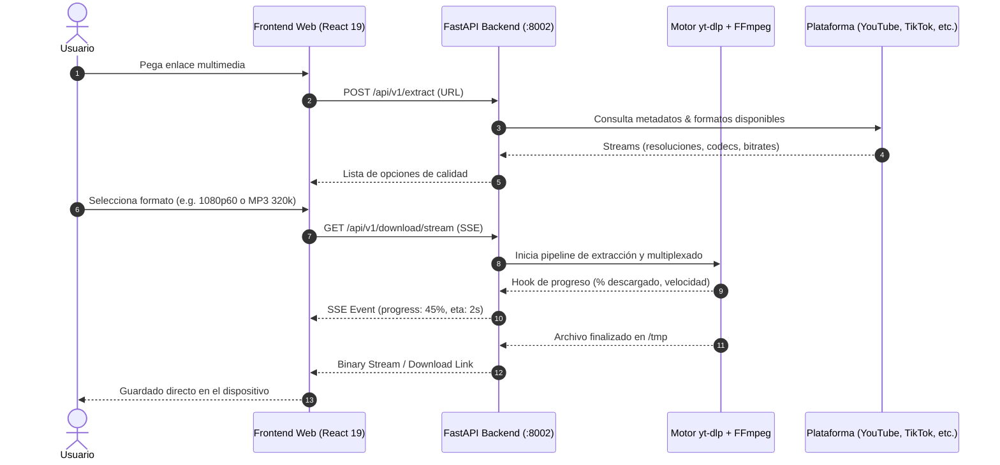

# AyeVideoDownloader — Studio-Grade Media Extraction Engine


**AyeVideoDownloader** es una suite de extracción y descarga multimedia de alta fidelidad del ecosistema **AyeApps** ([`video.ayeapps.com`](https://video.ayeapps.com)). Permite descargar video en resolución nativa (hasta 4K/8K 60fps HDR) y audio de alta resolución (MP3 320kbps, WAV, FLAC) desde plataformas como YouTube, TikTok, Instagram, X (Twitter), Facebook, Vimeo y SoundCloud sin publicidad ni compresión destructiva.

---

## Por qué este Stack

- **FastAPI + yt-dlp + FFmpeg Server-Side:** A diferencia de extensiones de navegador inestables o servicios plagados de adware, el procesamiento y demuxing se ejecutan en un backend asíncrono aislado con binarios nativos actualizados de `yt-dlp` y `ffmpeg`.
- **Telemetría en Vivo vía Server-Sent Events (SSE):** Progreso porcentual, velocidad de descarga y estado de transcodificación transmitidos en streaming en tiempo real hacia el cliente sin polling repetitivo.
- **Aislamiento en `/tmp/aye_downloads` con Auto-Purga:** Los archivos se procesan en un directorio temporal aislado con permisos restringidos de usuario non-root (`appuser`), garantizando privacidad y eliminación automática post-descarga.
- **Frontend React 19 + Vite:** Cliente web ligero y reactivo bajo los tokens de diseño Atelier (`Cyber-Amber #FE9D01`, paleta de obsidiana profunda, dot matrix interactivo y sombras neo-brutalistas).

---

## Flujo de Extracción y Descarga



---

## Estructura del Repositorio

```
ayevideodownloader/
├── api/                      # Backend FastAPI + yt-dlp
│   ├── app/
│   │   ├── api/v1/           # Endpoints de extracción, descarga y SSE
│   │   ├── core/             # Configuración, logging, rate limiting
│   │   └── services/         # Wrappers de yt-dlp, format parser y ffmpeg
│   ├── Dockerfile            # Imagen Debian con yt-dlp, FFmpeg y Python 3.13
│   ├── requirements.txt      # Dependencias backend
│   └── main.py               # Entrypoint FastAPI
├── frontend/                 # Cliente Web SPA (Vite + React 19)
│   ├── src/
│   │   ├── components/       # URLInput, FormatSelector, ProgressBar, AuthModal
│   │   ├── hooks/            # useSSEDownload, useExtractMedia
│   │   └── theme/            # Tokens Atelier y estilos globales
│   ├── public/               # Assets públicos y favicons
│   ├── package.json          # Dependencias cliente
│   └── vite.config.js        # Configuración Vite
├── PRODUCT.md                # Especificación de producto
└── docker-compose.yml        # Orquestación local api + frontend
```

---

## Variables de Entorno

### Backend (`api/.env`)
```env
APP_NAME=AyeVideoDownloader
APP_ENV=development
PORT=8002
DOWNLOAD_DIR=/tmp/aye_downloads
MAX_CONCURRENT_DOWNLOADS=5
JWT_SECRET_KEY=clave_compartida_con_aye_auth
CORS_ORIGINS=["http://localhost:5173","https://video.ayeapps.com"]
```

### Frontend (`frontend/.env`)
```env
VITE_API_URL=http://localhost:8002/api/v1
VITE_AUTH_API_URL=http://localhost:8000/api/v1
```

---

## Inicio Rápido

### 1. Iniciar Backend
```bash
cd api
python3 -m venv venv
source venv/bin/activate
pip install -r requirements.txt

# Asegúrate de tener ffmpeg instalado en tu sistema (e.g. brew install ffmpeg)
uvicorn main:app --reload --port 8002
```
- API Docs: [`http://localhost:8002/docs`](http://localhost:8002/docs)
- Health Check: [`http://localhost:8002/health`](http://localhost:8002/health)

### 2. Iniciar Frontend Web
```bash
cd frontend
npm install
npm run dev
```
- URL local: [`http://localhost:5173`](http://localhost:5173)

### 3. Ejecución con Docker
```bash
# Compilar y levantar con FFmpeg y yt-dlp preconfigurados
docker compose up -d
```

---

## Formatos y Calidades Soportadas

| Tipo | Formatos | Calidades Máximas |
| :--- | :--- | :--- |
| **Video + Audio** | MP4, MKV, WebM | 4K (2160p), 1440p, 1080p 60fps HDR |
| **Solo Audio** | MP3, M4A, FLAC, WAV | 320 kbps CBR / VBR Lossless |
| **Solo Video** | MP4, WebM (Mute) | 8K (4320p) |
